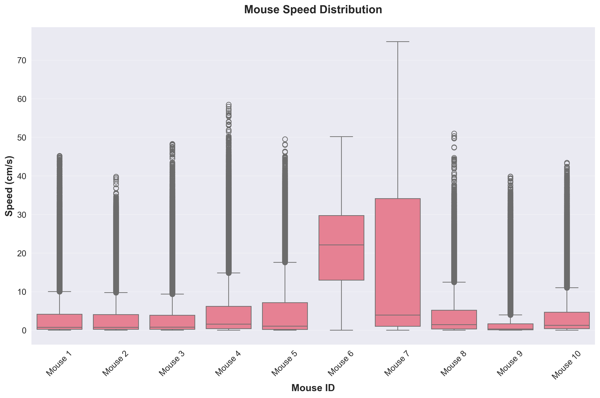
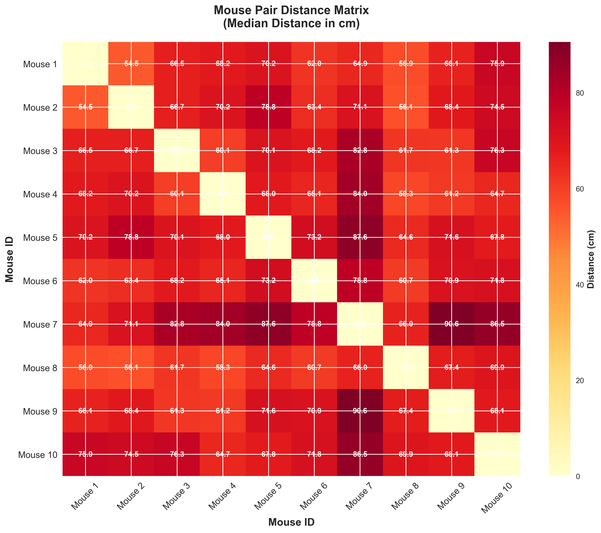
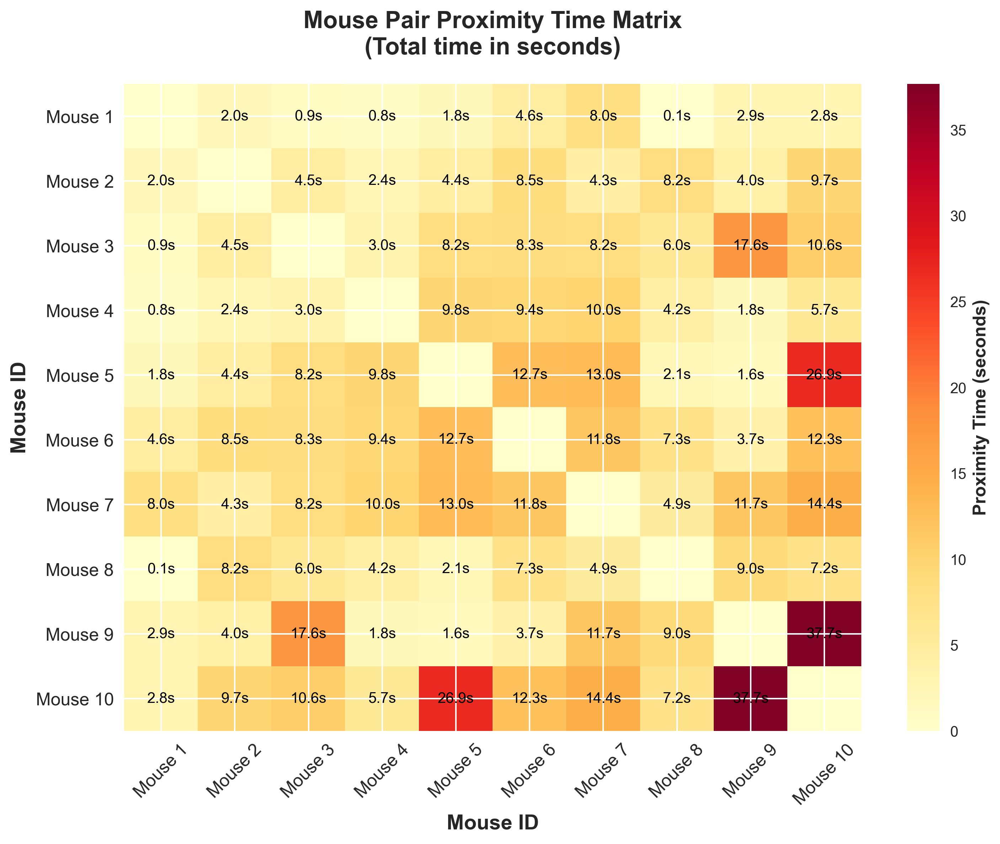
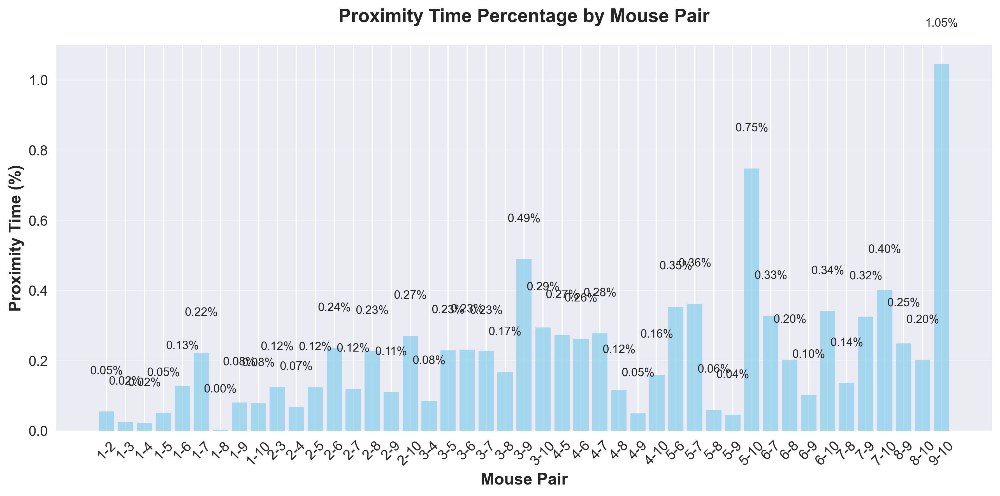
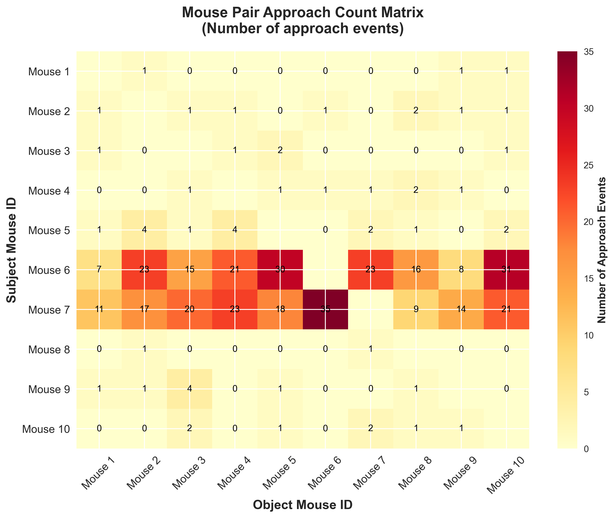
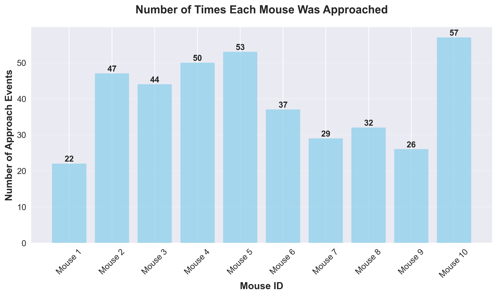

# PawPrint
[](https://github.com/psf/black)
[](https://github.com/pylint-dev/pylint)


PawPrint is a python package for social behavior analyse tool from animal trajectory data.

## Usage

**Step 1: Clone the repository**
```bash
git clone https://github.com/starrliu/PawPrint.git
cd PawPrint
```

**Step 2: Install dependencies**
```bash
pip install -r requirements.txt
```

**Step 3: Download the dataset**

You can download the sample data from [link](https://disk.pku.edu.cn/link/AAA918DF0706484EA99506EC1B5C57C0B9). This is a 1 hour trajectory data of 10 mice following [the format of idtracker.ai](https://idtracker.ai/latest/user_guide/output_structure.html#:~:text=trajectories%3A%20Numpy%20array%20with%20shape%20(N_frames%2C%20N_animals%2C%202)%20with%20the%20xy%20coordinate%20for%20each%20identity%20and%20frame%20in%20the%20video.).

**Step 4: Use API to analyze the data**
```python
from pawprint.data import TrajectoryCollection

# Load the data
tc = TrajectoryCollection(
    trajectory_path="path/to/your/data.csv",
    fps=30,
    scale=SCALE_FROM_PIXEL_TO_CM,
)
# Get the speed distribution of each identity
speeds = tc.to_speed(window_size=5, mode="mean")
```

## Example

PawPrint provides several analysis scripts in the `script/` folder for different types of social behavior analysis:

### Speed Analysis (`plot_speed.py`)
Analyzes and visualizes the speed distribution of each mouse using box plots. This script helps understand individual movement patterns and activity levels.

```bash
python script/plot_speed.py
```



### Distance Matrix Analysis (`plot_distance.py`)
Creates a heatmap visualization of median distances between all mouse pairs, helping identify spatial relationships and grouping patterns.

```bash
python script/plot_distance.py
```



### Proximity Time Analysis (`plot_proximity.py`)
Analyzes the total time each mouse pair spends in close proximity (within a specified distance threshold), providing insights into social bonding and interaction patterns.

```bash
python script/plot_proximity.py
```




### Approach Event Detection (`plot_approach.py`)
Detects and analyzes approach events between mouse pairs, including event counts, durations, and interaction patterns. This provides detailed information about social approach behaviors.

```bash
python script/plot_approach.py
```




## Contributing
We welcome contributions! Please read our [contributing guidelines](CONTRIBUTING.md) for more information on how to contribute to this project.